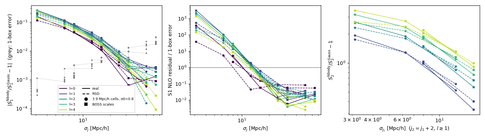
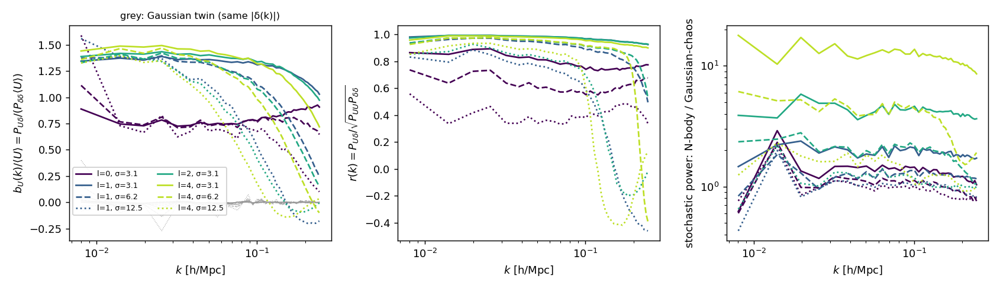
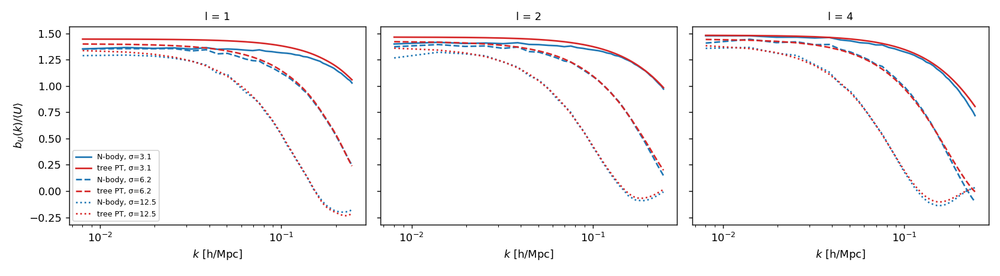

# Feasibility of an EFT model for the wavelet scattering transform

Assessment, 4 October 2026. The question is whether the 3D solid-harmonic
wavelet scattering transform (WST) of Valogiannis & Dvorkin
([arXiv:2204.13717](https://arxiv.org/abs/2204.13717)) can be modelled
analytically in the EFT of large-scale structure, in the way
[`dsc-model`](../../dsc-model/docs/density_split_eft.md) models density-split
clustering (DSC). This note derives the perturbative structure of the
coefficients and tests the key approximations on five Quijote fiducial
snapshots at z = 0.5 (dark matter only). It does not implement a model.

Reproduce everything with the `desi-clustering-classpt` environment:

```bash
python scripts/feasibility/wst_feasibility.py --realizations 0 1 10 100 1000
python scripts/feasibility/wst_feasibility.py --realizations 0 1 10 100 1000 --sigma0 2.048 --tag _boss_scales
python scripts/feasibility/summarize_feasibility.py --ladder
for r in 0 1 10; do python scripts/feasibility/modulus_field_spectra.py --realization $r; done
python scripts/feasibility/tree_response.py
python scripts/feasibility/check_edgeworth.py
```

Tables are written to `outputs/feasibility/`: `summary_ladder.md`,
`tree_response.md` and the per-coefficient `summary*.md`.

## Summary

1. **No perturbative model of the WST exists.** A literature search through
   October 2026 found none.
   - Every WST analysis is simulation-based: BOSS (2204.13717, 2310.16116),
     SimBIG and the Quijote Fisher forecasts.
   - The nearest analytic precedents are Gram–Charlier expansions of
     smoothed-field derivatives (Minkowski functionals), EFT and
     large-deviation models of the one-point PDF, and the one-loop marked
     power spectrum.

2. **The WST has a clean perturbative structure.**
   - The solid-harmonic wavelets are Gaussian-derivative filters. Each
     first-layer modulus \(U_{j,l}\) is therefore the rotation-invariant norm
     of a spin-l derivative of the smoothed field: the density for l=0, the
     gradient for l=1, the traceless Hessian for l=2, and so on.
   - S1 is a one-point statistic of these fields. For a Gaussian field it is
     an exact closed-form function of filtered band powers, so at Gaussian
     order it is a nonlinear compression of the monopole P(k).
   - S2 is a band power, at the larger scale σ_j2, of the clustering of
     \(U_{j_1,l}\).

3. **S1 is under control where perturbation theory holds, but its
   non-Gaussian content there is small.**
   - The next-to-leading Edgeworth correction for |X|^q of an
     O(2l+1)-invariant argument needs only two zero-lag invariants: a
     contracted tree trispectrum, and a squared tree bispectrum that enters
     only for even l.
   - With the measured cumulants it reproduces the N-body non-Gaussianity of
     S1 to within ≲2 single-box (1 Gpc/h)³ errors for σ_j ≥ 12.5 Mpc/h, where
     that non-Gaussianity is −1% to −4%.
   - At σ_j ≤ 8 Mpc/h the non-Gaussianity is −4% to −26%. The NLO residual
     there is 30 to thousands of single-box errors, so S1 would need NNLO
     terms or free nuisance parameters.
   - RSD anisotropy enters S1 only at second order, by ≤0.4%.

4. **S2 is dominated by the large-scale clustering of the modulus fields, and
   tree-level PT predicts it with no free parameters.**
   - For l ≥ 1 the N-body S2 exceeds its same-P(k) Gaussian value by +1% to
     +700%, and by at least +24% whenever σ_j1 ≤ 16 Mpc/h. Almost all of the
     excess sits in the second-layer variance, i.e. in the large-scale power
     of U.
   - U is an excellent biased tracer of the density. For l ≥ 1 and
     σ_j ≤ 6 Mpc/h, b_U/⟨U⟩ = 1.35–1.5 and the cross-correlation coefficient
     with δ is 0.93–0.99. For a Gaussian field b_U = 0 identically.
   - The tree bispectrum integrated against the exact wavelet kernels
     predicts b_U(k)/⟨U⟩ to ≤5.5% for σ_j1 = 3–12.5 Mpc/h, over the whole
     range k ≲ 1/σ_j1, including its scale dependence.
   - Adding a stochastic term, it reproduces the second-layer band power to
     ≤12% at 3 Mpc/h, ≤5% at 6 Mpc/h and ≤1% at 12.5 Mpc/h. This holds also
     for j2 = j1+1.
   - What remains non-perturbative:
     - the stochastic power of U, which reaches ~15× its Gaussian-chaos value
       at 3 Mpc/h for l=4;
     - the one-point normalisation ⟨U⟩ at small σ_j1, which largely cancels
       in the reduced coefficients S2/S1;
     - the shape of the second-layer distribution for j2 = j1+1.

5. **This is the DSC construction with a smooth selection, and smoothness
   makes it more predictive.**
   - U is a nonlinear, volume-weighted, local functional of the
     redshift-space field. Its large-scale clustering follows the renormalized
     response expansion, the scalar pull-back, the counterterms and the
     stochastic sector of the DSC theory.
   - Unlike a sharp quantile, |X| is smooth and O(n) invariant. Its responses
     can therefore be computed instead of freed, at least for matter in real
     space.
   - The DSC one-loop machinery for P_qm and P_qq maps onto P_Uδ and P_UU;
     S2 is then a derived band power.

6. **The open questions are galaxies, one-loop precision, redshift space and
   the window.**
   - In the BOSS configuration (σ_j = 8–128 Mpc/h) the reported 3–8× gain
     over P(k) comes from S2, since S0+S1 alone give 1.1–2×. S2's
     non-Gaussian signal is largest for σ_j1 = 8–16 Mpc/h.
   - For matter, their responses are predictable. For galaxies they depend on
     b1, b2 and bG2 (shared with the bispectrum), plus FoG and shot noise at
     k ~ 0.1–0.35 h/Mpc. This must be tested on HOD mocks.
   - Percent-level S2 (single-box errors 0.1–2%) needs the one-loop response
     and a fitted noise.
   - RSD responses (B0 + B2μ²) are not yet tested.
   - The survey window enters nonlinearly, and no window model exists for the
     WST.
   - S0 is out of reach.
   - Side finding: ACM's WST estimator appears to compute S1 and S2 with
     q = 0.5 (kymatio's default), not 0.8 (Sec. 1).

**Verdict.** It is feasible, and more promising than a naive DSC transcription
suggests, because the responses that drive S2 are calculable.

Recommended route: a staged, box-based programme (Sec. 6).
1. Exact Gaussian limit.
2. Matter in real space: tree-level responses for S2 and S2/S1, and NLO S1.
3. Redshift space and one-loop, built on the DSC machinery, with
   modulus-field spectra as a by-product.
4. Galaxies and survey windows, entered only after stage 3 shows information
   beyond P+B.

## 1. The statistic

All three published analyses use the kymatio implementation. Its filters are
built in Fourier space (k in radians per cell):

\[
\hat\psi^m_{j,l}(\mathbf k)=N_l(-i)^l(\sigma_jk)^lY_l^m(\hat{\mathbf k})\,
e^{-\sigma_j^2k^2/2},\qquad \sigma_j=2^j\sigma_0 .
\]

For l=0 the filter is a pure Gaussian with unit gain at k=0: a low-pass
filter, not a wavelet. With
\(U_{j,l}=(\sum_{m=-l}^{l}|\delta*\psi^m_{j,l}|^2)^{1/2}\), the coefficients are

\[
S_0=\langle|\delta|^q\rangle,\quad
S_1(j,l)=\langle U_{j,l}^q\rangle,\quad
S_2(j_1,j_2,l)=\Big\langle\Big(\sum_m|U_{j_1,l}*\psi^m_{j_2,l}|^2\Big)^{q/2}\Big\rangle,
\quad j_2>j_1 .
\]

- The exponent q acts only on the outer modulus of each layer, and the second
  layer reuses l.
- ⟨·⟩ is a lattice sum in the papers and a lattice mean in ACM.
- With J = L = 4, σ0 = 0.8 cells and q = 0.8 there are 1 + 25 + 50 = 76
  coefficients.

| | 2108.07821 | 2204.13717 | 2310.16116 |
|---|---|---|---|
| Field | Quijote matter, real space, z = 0 | CMASS FKP field, redshift space | same, constant n̄ |
| Mesh, cell | 256³, 3.9 Mpc/h | 282³ in 2820 Mpc/h, 10 Mpc/h, TSC | 270³, 10 Mpc/h, TSC |
| σ_j | 3.1·2^j Mpc/h | 8·2^j Mpc/h | 8·2^j Mpc/h |
| Model | Fisher, 15,000 sims | linear Taylor expansion on AbacusSummit + HOD | neural-net emulator, 151k cut-sky mocks |
| Reported gain | 1.2–4× over P(k) | 3–8× over P(k); S0+S1 alone 1.1–2× | WST+ξ 2.5–6× over ξ |

In 2204.13717 the mask is handled by a modified kymatio that the paper does
not describe in detail. 2310.16116 states that no window model exists for
the WST.

**Gaussian-derivative interpretation.** Applying a harmonic polynomial
\(P_l(\nabla)\) to a Gaussian gives \(P_l(-\mathbf x/\sigma^2)\) times the same
Gaussian (Hobson's formula). Hence
\(\delta*\psi^m_{j,l}\propto\mathcal Y^m_l(\sigma_j\nabla)\,\delta_{\sigma_j}\),
and up to normalisation:

| l | \(U_{j,l}\) |
|---|---|
| 0 | the smoothed density \(\lvert\delta_{\sigma_j}\rvert\) |
| 1 | the gradient magnitude \(\sigma_j\lvert\nabla\delta_{\sigma_j}\rvert\) |
| 2 | the norm of the traceless Hessian \(\sigma_j^2(\partial_i\partial_j-\delta_{ij}\nabla^2/3)\delta_{\sigma_j}\) |

S1 therefore belongs to the family of one-point statistics of smoothed fields
and their derivatives (counts-in-cells, Minkowski functionals, peaks). S2
belongs to the clustering of nonlinear transforms of those fields (marked
spectra, DSC). The m-sum is rotation invariant, so a varying line of sight
does not matter locally.

**ACM convention (to verify).**
- `acm/estimators/galaxy_clustering/wst.py` constructs `HarmonicScattering3D`
  without `integral_powers`, and kymatio's default is `(0.5, 1., 2.)`.
- The estimator keeps index 0 of the integral-power axis.
- Unless that is overridden elsewhere, S1 and S2 use q = 0.5 while S0 uses
  `self.q` = 0.8.

## 2. Perturbative structure

### 2.1 The Gaussian limit is exact

Let X be the real (2l+1)-vector of wavelet components (in real harmonics),
with covariance \(C_{mm'}=\int_{\mathbf k}P(\mathbf k)\hat\psi^m\hat\psi^{m'*}\).
In real space \(C=s^2I\), so |X|/s follows a chi distribution with n = 2l+1
degrees of freedom:

\[
S_1^{\rm G}=(2s^2)^{q/2}\frac{\Gamma[(n+q)/2]}{\Gamma(n/2)},\qquad
s^2_{j,l}=\frac1n\int_{\mathbf k}P(k)\sum_m|\hat\psi^m_{j,l}|^2 .
\]

In plane-parallel redshift space C is diagonal in m about the line of sight.
Its eigenvalues λ_m are filtered integrals of P_0, P_2 and P_4 (and of P_6
and P_8 at one loop), and

\[
S_1^{\rm G}=\frac{q/2}{\Gamma(1-q/2)}\int_0^\infty\frac{dt}{t^{1+q/2}}
\Big[1-\prod_m(1+2t\lambda_m)^{-1/2}\Big].
\]

Since \(\sum_m\lambda_m\) involves only the monopole, the anisotropy enters at
second order. On Quijote it moves S1 by at most 0.4%.

**S2.** For l ≥ 1 the second wavelet has zero mean. S2 is then controlled by
the second-layer variance, a band power at k ~ √l/σ_j2 of the modulus-field
spectrum \(P_{UU}\).

For a Gaussian field \(P_{UU}\) has a Wiener-chaos expansion. Its leading term
comes from the projection
\(U\simeq\langle U\rangle+\frac{\langle U\rangle}{2ns^2}(|X|^2-ns^2)\):

\[
P^{(2)}_{UU}(k)=\frac{\langle U\rangle^2}{4n^2s^4}\,2\!\int_{\mathbf p}P(p)P(|\mathbf k-\mathbf p|)
\Big|\sum_m\hat\psi^m(\mathbf p)\hat\psi^{m}(\mathbf k-\mathbf p)\Big|^2 .
\]

This is the 22-type operator auto-spectrum Y of DSC note §4, with |X|² in
place of s_R². On the Gaussian twins of the Quijote fields (Sec. 3):
- it carries 95–98% of the second-layer variance for l=0, 96–99.7% for l=1
  and ≥97.8% for l ≥ 2;
- the residual non-Gaussianity of the second-layer field changes S2 by
  ≤0.8% for l=1 and ≤0.2% for l ≥ 3.

As with sharp quantiles (DSC note §5), U is homogeneous in the field. Every
chaos order therefore scales identically with the amplitude, so a polynomial
truncation of |X| is not an amplitude expansion. Unlike an indicator, however,
|X| is continuous and O(n) invariant, so the Gaussian limit can be resummed
exactly.

### 2.2 Non-Gaussian corrections to S1

With x = X/s, the Edgeworth expansion of an O(n)-invariant function
collapses to

\[
\frac{S_1}{S_1^{\rm G}}=1+\frac{q(q-2)}{8n(n+2)}K_4
+\frac{q(q-2)(q-4)}{72\,n(n+2)(n+4)}\big(6K_{33}+9K_{3v}\big)+O(\sigma^4),
\]

where

\[
K_4=\sum_{ab}\kappa_{aabb}/s^4,\qquad
K_{33}=\sum_{abc}\kappa_{abc}^2/s^6,\qquad
K_{3v}=\sum_c\big(\sum_a\kappa_{aac}\big)^2/s^6 .
\]

The coefficients follow from
\(E_G[\nabla^{2p}r^q]=q(q-2)\cdots(q-2p+2)\,E_G[r^q]\), which is independent
of n (Appendix). A Monte Carlo test with weakly non-Gaussian vectors confirms
them: the residual is ~4% of the correction and scales as the next order
(`scripts/feasibility/check_edgeworth.py`). Odd moments vanish for odd l by parity, and
K_3v vanishes for l ≥ 1 in real space.

At NLO, S1 therefore needs the one-loop variance, the zero-lag tree
trispectrum contracted pairwise and, for even l, the squared zero-lag tree
bispectrum. All three are of relative order σ², which makes this a consistent
one-loop order.

For galaxies the ingredients are:
- P at one loop: b1, b2, bG2, bΓ3 and counterterms;
- B at tree level, with its stochastic terms;
- T at tree level: all cubic biases and its own stochastic terms;
- shot noise in every cumulant.

The renormalized one-point PDF of Chudaykin, Ivanov & Sibiryakov
([2212.09799](https://arxiv.org/abs/2212.09799)) is the closest precedent. It
has three EFT parameters, two of them tied to the P and B counterterms.

### 2.3 The second layer is the clustering of a selected field

On scales \(k\sigma_{j_1}\lesssim1\), U has a response expansion of the DSC
type:

\[
U_{j_1,l}=\langle U\rangle+b^U_\delta[\delta]+b^U_\eta[\eta]+\dots+\epsilon_U,\qquad
P_{UU}=(B^U_0+B^U_2\mu^2)^2P_L+N^U+O(k^2,\text{loops}).
\]

U is even in X, so for a Gaussian field \(b^U=0\) exactly. Its deterministic
large-scale clustering is therefore purely non-Gaussian: it is the response
of the local wavelet power to long modes.

**Tree level for l ≥ 1.** Contracting the second-chaos projection with δ gives

\[
\frac{P_{U\delta}(k)}{\langle U\rangle}=\frac{1}{2ns^2}\int_{\mathbf p}
B(\mathbf p,\mathbf k-\mathbf p,-\mathbf k)\,F(\mathbf p,\mathbf k-\mathbf p),
\qquad
F(\mathbf p,\mathbf q)=(-1)^l(\sigma_j^2pq)^lP_l(\hat{\mathbf p}\cdot\hat{\mathbf q})\,
e^{-\sigma_j^2(p^2+q^2)/2}.
\]

- This is an integrated bispectrum with the exact wavelet kernel. No
  derivative expansion in kσ_j1 is needed.
- In the squeezed limit it reduces to the separate-universe response
  \(\frac12[47/21+(3+2l)/3-\frac23\sigma_j^2\langle k^2\rangle_w]\), with
  \(w=(\sigma_jk)^{2l}e^{-\sigma_j^2k^2}P\).
- For l=0 the low-pass filter contains the long mode itself. That case needs
  the same integral with the l=0 kernel. The measured value, ≈0.75, is about
  half the squeezed estimate.

**Formal counting versus practice.** Formally the response term is O(σ²)
relative to the Gaussian chaos term. In practice the chaos term is white
noise on the scale σ_j2, with amplitude of order
\((\mathrm{Var}\,U/\langle U\rangle^2)\,\sigma_{j_1}^3\). The response term,
\((b^U/\langle U\rangle)^2P_L(k\sim1/\sigma_{j_2})\), carries no such volume
suppression. It dominates unless both scales are ≳25 Mpc/h, where the two
terms are comparable.

**Reduced coefficients.** The amplitude of S2 scales as ⟨U⟩^q, a one-point
quantity that is non-perturbative at small σ_j1. At NLO the non-Gaussian
shifts of ⟨U^q⟩ and ⟨U⟩^q are in the ratio 2 − q = 1.2, and the measured
ratio is 1.15–1.2. The reduced coefficients S2/S1(j1) therefore cancel
about 80% of the one-point non-Gaussianity, leaving roughly 1% at 8 Mpc/h
and 0.3% at 16 Mpc/h. This is the EFT-friendly form of the second layer.

**What transfers from DSC:**
- conditional responses;
- the scalar pull-back to redshift space, with no number-density Jacobian and
  an unprotected B0 + B2μ²;
- field-level counterterms;
- the stochastic sector, including the projected-stress k²μ⁴ term;
- IR resummation of the long modes;
- Taylor emulation and analytic marginalisation. The latter works on
  \(S_2^{2/q}\), which is affine in \((B^U)^2\) and N^U at leading order.

**What does not transfer:**
- the partition constraints; instead, U fields at different (j,l) are
  strongly correlated;
- thresholds and Hermite coefficients, replaced by chi/Laguerre ones;
- the observable, which is a single nonlinear band power per (j1, j2, l)
  rather than a spectrum;
- S1 as a whole, which is a one-point quantity with no DSC analogue (DSC
  fixes p_q).

The crucial difference: DSC frees its responses because a sharp selection is
not perturbatively calculable, whereas the modulus responses are (Sec. 3.3).

## 3. Measurements on Quijote at z = 0.5

**Setup.** Five fiducial snapshots (realizations 0, 1, 10, 100 and 1000;
512³ CDM particles, 1 Gpc/h) are CIC-assigned to a 256³ mesh, in real space
and in plane-parallel redshift space along z. The WST settings are J = L = 4 and q = 0.8, in two scale
configurations:
- σ0 = 0.8 cells: σ_j = 3.1–50 Mpc/h, the 2108.07821 scales;
- σ0 = 2.048 cells: σ_j = 8–128 Mpc/h, the BOSS scales. Coefficients beyond
  64 Mpc/h are dropped, since they are meaningless in a 1 Gpc/h box.

**Definitions.**
- *Gaussian twin:* a copy of each field with identical |δ(k)| and random
  phases. By Parseval the twin shares every wavelet covariance, so its S1 is
  the Gaussian prediction.
- *NG:* S[N-body]/S[twin] − 1, i.e. everything P(k) does not fix.
- *1-box stat:* the realization scatter for a single (1 Gpc/h)³ volume. This
  is the most demanding precision case.
- *NLO resid.:* the N-body non-Gaussianity of S1 that remains after the
  Edgeworth NLO correction built from the measured cumulants.



The figure plots each quantity against the filter scale. Circles are the
3.9 Mpc/h-cell configuration and squares the BOSS-scale one; solid lines are
real space and dashed lines redshift space.
- Left: the non-Gaussian part of S1, with the single-box error in grey.
- Middle: the S1 residual after NLO Edgeworth, in units of the single-box
  error.
- Right: the non-Gaussian part of S2 for l ≥ 1 and j2 = j1+2.

### 3.1 First layer

| σ_j [Mpc/h] | k90 [h/Mpc] | 1-box stat | NG real | NG RSD | NLO resid. real | NLO resid. RSD | max abs(resid.)/stat |
|---|---|---|---|---|---|---|---|
| 3.1 | 0.40–0.80 | 0.02 … 0.11% | -25.6 … -15.3% | -20.2 … -11.4% | +42.29 … +93.21% | +4.04 … +13.31% | 3208.4 |
| 6.2 | 0.22–0.43 | 0.04 … 0.25% | -11.6 … -6.5% | -11.3 … -6.1% | +4.25 … +9.98% | +1.07 … +3.65% | 105.7 |
| 8.0 | 0.18–0.34 | 0.06 … 0.32% | -8.0 … -4.4% | -8.5 … -4.5% | +1.63 … +4.03% | +0.54 … +2.08% | 27.7 |
| 12.5 | 0.12–0.22 | 0.20 … 0.48% | -3.6 … -1.9% | -4.4 … -2.2% | +0.15 … +0.63% | +0.02 … +0.58% | 1.9 |
| 16.0 | 0.09–0.17 | 0.33 … 0.59% | -2.2 … -1.1% | -2.8 … -1.4% | -0.03 … +0.17% | -0.07 … +0.23% | 0.6 |
| 25.0 | 0.06–0.11 | 0.43 … 0.97% | -0.7 … -0.3% | -1.0 … -0.4% | -0.05 … +0.01% | -0.07 … +0.04% | 0.1 |
| 32.0 | 0.05–0.09 | 0.41 … 1.30% | -0.3 … -0.1% | -0.4 … -0.1% | -0.01 … +0.01% | -0.06 … +0.04% | 0.1 |
| 50.0 | 0.03–0.06 | 0.84 … 2.16% | -0.1 … +0.3% | -0.1 … +0.2% | -0.05 … +0.07% | -0.18 … +0.03% | 0.1 |
| 64.0 | 0.03–0.04 | 1.54 … 3.35% | -0.1 … +0.3% | -0.0 … +0.3% | -0.07 … +0.05% | -0.18 … -0.01% | 0.1 |

Ranges are over l = 0…4. The last column is the largest NLO residual in
units of the single-box error.
- **Size.** The non-Gaussian part of S1 falls from −11% to −25% at 3 Mpc/h,
  to −1% to −3% at 16 Mpc/h, and to ≲1% beyond 25 Mpc/h. It is similar in
  real and redshift space.
- **NLO.** Given the exact cumulants, the NLO correction removes 80–100% of
  it for σ_j ≥ 12.5 Mpc/h.
  - The residual is ≤2 single-box errors at 12.5 Mpc/h, ≤0.6 at 16 Mpc/h
    and ≤0.2 beyond.
  - At 8 Mpc/h the residual is ~30 single-box errors, and at 3–6 Mpc/h it is
    100–3000.
  - S1 below ~10 Mpc/h is thus a precision measurement of one-point
    non-Gaussianity that an NLO model cannot match.
- **Caveat.** A real model takes the cumulants from tree-level PT, which adds
  its own O(σ²) errors. This test isolates the truncation of the Edgeworth
  (selection) expansion.

### 3.2 Second layer

| σ_j1→σ_j2 [Mpc/h] | 1-box stat | NG real | NG RSD | variance share of NG | shape real | shape after Y-NLO |
|---|---|---|---|---|---|---|
| 3.1→6.2 | 0.1 … 0.3% | +103 … +172% | +93 … +130% | 106 … 124% | -16.3 … -4.0% | +0.77 … +21.40% |
| 3.1→12.5 | 0.2 … 0.5% | +194 … +352% | +176 … +269% | 101 … 106% | -6.1 … -1.7% | +0.10 … +2.11% |
| 3.1→25.0 | 0.4 … 0.9% | +294 … +535% | +269 … +433% | 100 … 101% | -1.3 … -0.4% | -0.01 … +0.05% |
| 3.1→50.0 | 0.7 … 1.7% | +384 … +709% | +351 … +593% | 100 … 100% | -0.1 … +0.3% | -0.04 … +0.07% |
| 6.2→12.5 | 0.3 … 0.7% | +81 … +153% | +80 … +132% | 102 … 112% | -7.2 … -1.4% | +0.05 … +2.88% |
| 6.2→25.0 | 0.4 … 1.1% | +129 … +273% | +128 … +239% | 100 … 102% | -1.8 … -0.5% | +0.01 … +0.15% |
| 6.2→50.0 | 0.5 … 1.4% | +173 … +351% | +172 … +318% | 100 … 100% | -0.2 … +0.1% | -0.04 … +0.09% |
| 8.0→16.0 | 0.4 … 1.0% | +65 … +128% | +68 … +118% | 101 … 110% | -5.4 … -1.0% | +0.02 … +1.44% |
| 8.0→32.0 | 0.4 … 1.0% | +99 … +220% | +103 … +204% | 100 … 101% | -1.1 … -0.3% | -0.01 … +0.06% |
| 8.0→64.0 | 1.2 … 1.8% | +128 … +277% | +134 … +263% | 100 … 100% | -0.0 … +0.2% | -0.03 … +0.09% |
| 12.5→25.0 | 0.9 … 1.3% | +37 … +81% | +42 … +84% | 101 … 109% | -3.5 … -0.6% | +0.03 … +0.39% |
| 12.5→50.0 | 0.5 … 1.9% | +52 … +130% | +61 … +133% | 100 … 101% | -0.6 … -0.1% | -0.03 … +0.09% |
| 16.0→32.0 | 0.8 … 1.5% | +24 … +56% | +29 … +62% | 101 … 109% | -2.7 … -0.5% | +0.01 … +0.32% |
| 16.0→64.0 | 1.1 … 2.9% | +33 … +91% | +40 … +99% | 100 … 102% | -0.6 … +0.0% | -0.02 … +0.08% |
| 25.0→50.0 | 1.6 … 3.5% | +8 … +25% | +10 … +32% | 101 … 114% | -1.8 … -0.2% | +0.00 … +0.36% |
| 32.0→64.0 | 2.3 … 5.0% | +1 … +15% | +3 … +20% | 101 … 143% | -1.3 … -0.2% | -0.02 … +0.18% |

Ranges are over l = 1…4. "Variance share" is
ln(1 + variance part)/ln(1 + NG). "Shape after Y-NLO" is what remains of the
second-layer non-Gaussianity after the Edgeworth correction built from the
measured second-layer K4.
- **Size.** For l ≥ 1 the non-Gaussian excess is +65% to +700% for
  σ_j1 ≤ 8 Mpc/h, +24% to +99% at 16 Mpc/h, and +1% to +32% at
  25–32 Mpc/h.
- **Where it sits.** The variance share is ≈100%: the excess is the
  second-layer variance, i.e. the large-scale power of U.
- **Shape.** The shape of the second-layer distribution matters only for
  j2 = j1+1 (up to −16% at 3→6 Mpc/h). The Edgeworth correction leaves
  ≲0.15% for j2 ≥ j1+2 at σ_j1 ≥ 6 Mpc/h. For j2 = j1+1 it leaves ≲0.4% at
  σ_j1 ≥ 12.5 Mpc/h, 1.4% at 8 Mpc/h, 2.9% at 6 Mpc/h and 21% at 3 Mpc/h.
- **Consequence.** S2 ≈ C_l(q)[band power of P_UU]^{q/2}(1 + Edgeworth), so
  the modelling problem reduces to P_UU.

### 3.3 Modulus-field clustering and its tree-level prediction



The figure shows real space, realization 0, at σ_j = 3.1, 6.2 and 12.5 Mpc/h.
- **Bias (left).** b_U(k)/⟨U⟩ is 1.35–1.5 for l ≥ 1 and ≈0.75 for l=0. It is
  flat up to kσ_j ≈ 0.3 and then falls. The Gaussian twins (grey) give zero.
- **Correlation (middle).** The cross-correlation coefficient with δ is
  0.93–0.99 for l ≥ 1 at σ_j ≤ 6 Mpc/h, and 0.75–0.9 for l=0.
- **Noise (right).** The stochastic power is 1–2× its Gaussian-chaos value for
  l ≤ 1. It rises to 4–15× for l ≥ 2 at 3 Mpc/h, where halo-scale structure
  contributes, and returns to ≈1 at larger σ_j.



Three realizations (0, 1, 10), real space.

| (j,l) | σ_j [Mpc/h] | b_U/⟨U⟩ N-body (k < 0.3/σ_j) | tree PT | ratio (mean ± scatter) |
|---|---|---|---|---|
| 0,1 | 3.1 | 1.347 | 1.425 | 0.945 ± 0.001 |
| 1,1 | 6.2 | 1.343 | 1.379 | 0.974 ± 0.009 |
| 2,1 | 12.5 | 1.289 | 1.321 | 0.976 ± 0.100 |
| 0,2 | 3.1 | 1.389 | 1.435 | 0.968 ± 0.001 |
| 1,2 | 6.2 | 1.369 | 1.394 | 0.982 ± 0.005 |
| 2,2 | 12.5 | 1.298 | 1.339 | 0.970 ± 0.054 |
| 0,4 | 3.1 | 1.422 | 1.437 | 0.989 ± 0.002 |
| 1,4 | 6.2 | 1.403 | 1.402 | 1.001 ± 0.003 |
| 2,4 | 12.5 | 1.346 | 1.352 | 0.995 ± 0.005 |

| (j1,j2,l) | σ_j1→σ_j2 | (tree b² P + N_N-body)/V | (tree b² P + N_chaos)/V | response share of V |
|---|---|---|---|---|
| 0,2,1 | 3.1→12.5 | 1.093 | 1.091 | 1.03 |
| 0,3,1 | 3.1→25.0 | 1.115 | 1.113 | 1.08 |
| 0,4,1 | 3.1→50.0 | 1.122 | 1.121 | 1.10 |
| 1,2,1 | 6.2→12.5 | 1.032 | 1.035 | 0.84 |
| 1,3,1 | 6.2→25.0 | 1.042 | 1.044 | 0.92 |
| 1,4,1 | 6.2→50.0 | 1.045 | 1.047 | 0.97 |
| 2,3,1 | 12.5→25.0 | 1.006 | 1.018 | 0.58 |
| 2,4,1 | 12.5→50.0 | 1.010 | 1.027 | 0.68 |
| 0,3,2 | 3.1→25.0 | 1.061 | 1.038 | 1.02 |
| 0,4,2 | 3.1→50.0 | 1.070 | 1.057 | 1.05 |
| 1,3,2 | 6.2→25.0 | 1.017 | 0.976 | 0.91 |
| 1,4,2 | 6.2→50.0 | 1.026 | 1.000 | 0.96 |
| 2,3,2 | 12.5→25.0 | 1.002 | 0.953 | 0.67 |
| 2,4,2 | 12.5→50.0 | 1.000 | 0.966 | 0.75 |
| 0,3,4 | 3.1→25.0 | 1.029 | 0.967 | 0.96 |
| 0,4,4 | 3.1→50.0 | 1.018 | 0.984 | 0.98 |
| 1,3,4 | 6.2→25.0 | 0.976 | 0.885 | 0.85 |
| 1,4,4 | 6.2→50.0 | 0.983 | 0.926 | 0.90 |
| 2,3,4 | 12.5→25.0 | 0.999 | 0.914 | 0.69 |
| 2,4,4 | 12.5→50.0 | 0.989 | 0.907 | 0.78 |

The first table is the response b_U/⟨U⟩, averaged over k < 0.3/σ_j and
three realizations. The second gives the second-layer band power predicted
from the tree-level b_U(k), the measured P_δδ and a noise term, relative to
the measured band power of P_UU. The noise term is either the measured
N-body stochastic power or its Gaussian-chaos value. Only bands contained in
k < 0.25 h/Mpc are shown.
- **Response.** Tree-level PT, with no free parameter, reproduces b_U(k)/⟨U⟩
  to 0–5.5% at k < 0.3/σ_j. It also follows the scale dependence up to
  k ≈ 0.25 h/Mpc, including the sign change at σ_j = 12.5 Mpc/h. The largest
  deviation (−5.5%) is for l=1 at 3 Mpc/h, where nonlinear responses are
  suppressed.
- **Second-layer band power.** With the measured stochastic power it is
  reproduced to ≤1% for σ_j1 = 12.5 Mpc/h, ≤5% for 6.2 Mpc/h and ≤12% for
  3.1 Mpc/h. This holds for j2 = j1+1 as well. The white-plus-k² noise
  parameters of an EFT would absorb that stochastic power.
- **Noise.** Its Gaussian-chaos value is adequate for l ≤ 1. It
  underestimates the band power by up to ~10% for l = 4 at ≤6 Mpc/h, where
  halo-scale structure dominates the noise.

## 4. What an EFT model can cover

For the BOSS configuration (76 coefficients), using matter at z = 0.5 as a
proxy:

| Group | # | Status |
|---|---|---|
| S0 | 1 | out: cell scale, NG −33% |
| S1, σ_j = 8 Mpc/h | 5 | NNLO needed: NG −4% to −9%, NLO residual 0.5–4% (~30 single-box errors) |
| S1, σ_j = 16 Mpc/h | 5 | NLO adequate: NG −1% to −3%, residual ≤0.2% (≤0.6 single-box errors) |
| S1, σ_j ≥ 32 Mpc/h | 15 | Gaussian order + NLO; little information beyond P(k) |
| S2, l = 0 | 10 | ≈ ⟨\|δ_σj1\|⟩^q: like S1 at σ_j1 with q = 1 (NNLO needed at 8 Mpc/h) |
| S2, l ≥ 1, σ_j1 ≥ 16 Mpc/h | 24 | tree response + noise (≤1% in band power at 12.5 Mpc/h); one loop for precision |
| S2, l ≥ 1, σ_j1 = 8 Mpc/h | 16 | tree response works for matter (≤5% in b_U); galaxies to be tested; for j2 = j1+1 also second-layer NNLO |

For matter, everything except S0 and the 8 Mpc/h one-point quantities is
within reach of a one-loop-order model. Their precision would follow from the
response at one loop and a fitted noise.

The galaxy question is open. The S2 coefficients with σ_j1 = 8–16 Mpc/h carry
the largest non-Gaussian signal and drive the reported gains. For galaxies
they depend on how well PT describes the response of 8–16 Mpc/h galaxy power,
in redshift space and with shot noise.

### 4.1 Why S0 is out of reach

S0 = ⟨|δ_cell|^q⟩ is the l = 0 one-point moment at the smallest scale
available, the cell itself. Its only smoothing is the mass-assignment kernel,
whose 1D variance is H²/6 for CIC and H²/4 for TSC. That makes it roughly a
Gaussian of σ ≈ 1.6 Mpc/h for CIC on 3.9 Mpc/h cells, and σ ≈ 5 Mpc/h for TSC
on the 10 Mpc/h BOSS cells. Both are below the smallest wavelet (σ_0 = 3.1 or
8 Mpc/h).

Measured on realization 0 at z = 0.5 with `scripts/feasibility/s0_diagnostics.py`:

| Field | Cell variance | Variance from k > 0.25 h/Mpc | Skewness | NG of S0 | Cells with δ < −0.5 / their share of S0 |
|---|---|---|---|---|---|
| matter, CIC 3.9 Mpc/h, real | 1.93 | 78% | 9.6 | −33% | 38% / 40% |
| matter, CIC 3.9 Mpc/h, RSD | 1.50 | 61% | 3.8 | −19% | 44% / 43% |
| matter, CIC 10 Mpc/h, real | 0.40 | 25% | 2.7 | −12% | 15% / 20% |
| matter, TSC 10 Mpc/h, real | 0.29 | 14% | 2.2 | −9% | 10% / 15% |
| matter, TSC 10 Mpc/h, RSD | 0.38 | 10% | 2.0 | −8% | 17% / 23% |
| subsample at n̄ = 3×10⁻⁴ (h/Mpc)³, TSC 10 Mpc/h, real | 0.84 | 26% | 1.8 | −5% | 36% / 42% |
| uniform randoms at the same n̄, TSC 10 Mpc/h | 0.55 | 33% | 1.1 | −0.2% | 30% / 38% |

There are four separate obstacles.

1. **No perturbative regime.**
   - On the 3.9 Mpc/h mesh σ_cell ≈ 1.2–1.4, and 61–78% of the cell variance
     comes from k > 0.25 h/Mpc, even before aliasing folds in more.
   - Neither the one-loop variance nor an Edgeworth expansion converges
     there.
   - The non-Gaussian shift is −19% to −33%, while the single-box precision
     of S0 is 0.04–0.05%. A model would have to get a 20–30% non-Gaussian
     effect right to about one part in 500.
2. **S0 is set by the estimator definition, not just the physics.**
   - The cell value is an aliased sample of the field convolved with a cubic,
     anisotropic kernel. Its variance is
     \(\sum_{\mathbf n}W^2(\mathbf k+2\pi\mathbf n/H)P(\mathbf k+2\pi\mathbf n/H)\),
     which requires P(k) well beyond the Nyquist frequency.
   - Switching from CIC to TSC on the same 10 Mpc/h mesh changes S0 by 10%
     and its non-Gaussian part from −12% to −9%.
3. **Voids dominate.**
   - 15–43% of S0 comes from cells with δ < −0.5. Their |δ|^q ≈ 0.6–1 is set
     by the bounded (δ ≥ −1), strongly skewed void side of the PDF.
   - That is where moment expansions fail first. Even for spherical cells it
     requires large-deviation methods.
4. **Shot noise for galaxies.**
   - At BOSS density there are ≈0.3 galaxies per 10 Mpc/h cell. Poisson noise
     alone then gives a cell variance of 0.55.
   - For an unbiased tracer that is two thirds of the total (0.84). For a
     b ≈ 2 sample it is still about one third.
   - S0 of a pure random catalogue (0.63) is close to that of the clustered
     subsample (0.71). In a survey, S0 therefore largely tracks n̄(z), the FKP
     weights and the random catalogue.
   - The clustering part that remains is the counts-in-cells distribution at
     ~5 Mpc/h, which is set by the halo occupation. That is precisely what an
     EFT does not model.

**What to do instead.**
- Drop S0. In 2204.13717, S0 and S1 together add only 1.1–2× over P(k).
- If the one-point information is wanted, replace S0 by an isotropic,
  physically smoothed moment at R ≥ 12–16 Mpc/h. This could be one more
  S1(j, 0) at larger σ, covered by §2.2. It could also be the moments of
  spherical counts-in-cells, for which LDT + EFT reaches sub-percent accuracy
  for matter at R ≥ 10 Mpc/h (Chudaykin, Ivanov & Sibiryakov).
- If S0 must stay for comparison with published analyses, give it a free
  amplitude, which removes its information, or emulate it separately.

## 5. Risks

- **Galaxies at 8–16 Mpc/h.**
  - The response of small-scale galaxy power to long modes involves b1, b2
    and bG2 at tree level, plus FoG and shot noise. With BOSS-like density
    there are only a few galaxies per 8 Mpc/h filter volume, so Poisson
    non-Gaussianity is O(1) there.
  - Whether the tree or one-loop response holds for galaxies at k_s ~
    0.1–0.35 h/Mpc must be tested on HOD mocks. This is the main scientific
    risk, because these coefficients carry most of the information.
- **Precision.**
  - S1 at ≤12.5 Mpc/h and S2 at the 0.1–2% level need one-loop responses,
    the fitted noise and, for S1, NNLO Edgeworth terms.
  - Order-by-order convergence must be demonstrated, as in DSC milestone M7.
- **Redshift space.** The responses to the line-of-sight velocity gradient
  (B2) and the m-dependent second-layer covariance are not yet tested. The
  required Z kernels exist in `density_split_eft/operators.py`.
- **Window and estimator.**
  - |·|^q makes the window nonlinear. For surveys the model must predict
    local covariance maps C(x) of the masked filtered fields. Their Gaussian
    part is linear in P and computable by FFT. The second-layer response
    terms need the same treatment applied to the bispectrum.
  - Alternatively, redefine the estimator with interior weights.
  - Periodic boxes avoid the issue.
- **Numerics.**
  - The zero-lag tree trispectrum (for S1) in redshift space with bias is a
    9D integral before reduction. Separable kernels, or Monte Carlo over PT
    fields on the analysis mesh, make it tractable. It is the largest new
    code item.
  - The response integrals are 2D in real space and 3D in redshift space,
    and cheap.

## 6. Recommended path

The stages are gated in the style of the DSC milestones. Each starts with
matter in periodic boxes.

1. **Gaussian limit (days).**
   - Build exact S1^G in real and redshift space, and S2^G from the chaos
     expansion plus a Gaussian second layer. Use the actual lattice, mass
     assignment and kymatio normalisation.
   - Gate: agreement with the mean of many Gaussian twins to ≤0.05% for S1
     and ≤0.3% for S2.
2. **Matter in real space (weeks).**
   - S2 from the tree-level responses (Sec. 3.3), with white plus k² noise
     and the Edgeworth second-layer correction. Use reduced coefficients
     S2/S1(j1) to cancel the non-perturbative ⟨U⟩.
   - S1 at NLO: the one-loop variance from the shared CLASS-PT inputs, plus
     the zero-lag tree B and T.
   - Gate: residuals at or below one single-box error on the mean of the
     cluster ensemble, with stable scale cuts.
3. **Redshift space and one loop (weeks to months).**
   - Reuse `density_split_eft` for the selected-field kernels (B0 + B2μ²),
     the one-loop P_Uδ/P_UU tables, IR resummation and the Taylor emulator.
   - Measure P_Uδ and P_UU' (ℓ = 0, 2, 4) on the 1500 Quijote boxes with the
     DSC measurement and window pipeline, as a direct test of the response
     model. These spectra are useful observables in their own right: for
     l ≥ 1 they are non-Gaussian-only tracers.
   - Gate: S2 to sub-percent for the BOSS-scale configuration.
4. **Galaxies and surveys (decision point).**
   - Use HOD mocks (AbacusSummit) with shot noise and FoG.
   - Run a Fisher comparison of P + WST against P + B under the same EFT
     priors.
   - Choose a window strategy.

**A complementary route** is a grid-based perturbative forward model: LPT plus
bias operators plus noise on the analysis mesh, with the WST computed
numerically. It handles mask, mesh and |·|^q exactly, at the cost of Monte
Carlo noise and per-cosmology evaluation. It is a useful cross-check of the
analytic model.

**Code reuse from DSC.**
- Directly reusable:
  - SPT/RSD kernels (`operators.py`);
  - CLASS-PT inputs (`classpt.py`, `angular.py`);
  - IR resummation (`ir.py`) and FFTLog (`correlation.py`);
  - loop quadrature;
  - Taylor emulation, analytic marginalisation, samplers and covariance
    tooling.
- Needs adaptation:
  - AP, which needs a filter-level treatment (an ellipsoidal ψ in λ_m);
  - the selected-field operator basis, which applies to U with computed
    rather than free responses.
- Not needed: partition matrices and quantile thresholds.

**Science cases.**
- Local primordial non-Gaussianity. The modulus-field response acquires a
  scale-dependent \(b^U_\phi f_{\rm NL}/k^2\) term, which S2 at large j2
  compresses (cf. Peron et al., [2403.17657](https://arxiv.org/abs/2403.17657)).
- Robust large-scale WST constraints.
- Consistency checks of emulator analyses.
- A quantitative answer to which N-point information the WST compresses: in
  the perturbative regime it is P(k) plus the squeezed bispectrum and
  collapsed trispectrum.

## 7. Decisions needed

1. **Target.** A box-based theory and validation paper, or a survey analysis
   (which needs a window solution).
2. **Data vector.** One of:
   - the standard 76-coefficient WST, with reduced S2/S1;
   - a PT-friendly configuration (σ0 ≳ 8–12 Mpc/h, finer than octave scale
     steps, no S0);
   - modulus-field spectra, with S2 as a derived check.
3. **Responses.** Computed (most information, needs galaxy validation), or
   free with PT-centred priors (robust).

## Appendix: derivations

**Edgeworth coefficients.**
- The Gram–Charlier density is
  \(\phi(x)[1+\kappa^{abc}He_{abc}/6+\kappa^{abcd}He_{abcd}/24
  +\kappa^{abc}\kappa^{def}He_{abcdef}/72+\dots]\).
- Integrating by parts gives
  \(E_G[g\,He_{a_1\dots a_{2p}}]=E_G[\partial_{a_1}\cdots\partial_{a_{2p}}g]\).
- For O(n)-invariant g this tensor is isotropic, with
  \(A_4=E_G[\nabla^4g]/n(n+2)\) and, summing over the 15 pairings,
  \(A_6=E_G[\nabla^6g]/n(n+2)(n+4)\).
- Contracting with κ gives \(3K_4\) and \(6K_{33}+9K_{3v}\).
- For g = r^q,
  \(\nabla^{2p}r^q=\prod_{i<p}(q-2i)(q+n-2-2i)\,r^{q-2p}\) and
  \(E[r^{q-2p}]/E[r^q]=1/\prod_{i=1}^{p}(n+q-2i)\). The n-dependent factors
  cancel. Direct moments confirm the result for small n.

**Anisotropic Gaussian moment.** For 0 < a < 1,
\(y^a=\frac{a}{\Gamma(1-a)}\int_0^\infty(1-e^{-ty})t^{-1-a}dt\), and
\(E[e^{-t|X|^2}]=\prod_m(1+2t\lambda_m)^{-1/2}\).

**Response of U.**
- The second-chaos coefficient is \(\beta=\mathrm{Cov}(U,|X|^2)/\mathrm{Var}|X|^2=\langle U\rangle/2ns^2\).
- Hence \(P_{U\delta}=\beta\sum_a\kappa(X_a,X_a,\delta)\), with the vector
  trace of κ_abc vanishing for l ≥ 1.
- Squeezed limit: \(d\ln P/d\delta_L=47/21-\frac13d\ln P/d\ln k\), with
  \(\langle d\ln P/d\ln k\rangle_w=-(3+2l)+2\sigma_j^2\langle k^2\rangle_w\).
